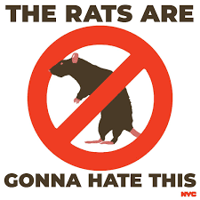

```{r packages, message = FALSE}
library(tidyverse)
library(janitor)
library(knitr)
library(tidyr)
library(readxl)
library(lubridate)
library(readr)
library(stringr)
library(ggplot2)
library(tibble)
library(dbplyr)
library(stats)
library(plotly)
library(ggridges)
library(forecast)
library(patchwork)
library(dplyr)
library(flexdashboard)
library(leaflet)
library(shiny)

library(leaflet.providers)

knitr::opts_chunk$set(
	echo = TRUE,
	warning = FALSE,
	fig.width = 8, 
  fig.height = 7,
  out.width = "90%"
)


theme_set(theme_minimal() + theme(legend.position = "bottom"))

options(
  ggplot2.continuous.colour = "viridis",
  ggplot2.continuous.fill = "viridis"
)

scale_colour_discrete = scale_color_viridis_d
scale_fill_discrete = scale_fill_viridis_d
```
## Motivation

The primary goal of this project is to conduct a thorough analysis of rat sightings in New York City, focusing on the periods before and after the implementation of new trash pickup times, which shifted from after 4 pm to after 8 pm as of April 1, 2023. This change is part of Mayor Eric Adams' rat mitigation strategies, and our study aims to assess its effectiveness. 

The motivation behind this research is rooted in the significant public health concerns associated with increased rat sightings, especially post-COVID-19. Rats are known vectors for various diseases and can contaminate human food sources, posing a considerable health risk. We like many New Yorkers see rats as a major problem given the health risks they pose. This problem has only worsened following the pandemic. New York City government agrees and has implemented and promoted a flashy new initiative they are calling "Send Rats Packing." https://www.nyc.gov/assets/queenscb2/downloads/pdf/notices/2023/SetoutTimes-Residential-Flyer-2023-02.pdf This initiative is mainly composed of a new rule involving trash that aims to reduce the time that trash, recycling, and curbside composting will sit on the sidewalk. The new rule went into effect on April 1, 2023 and left Residential buildings and their managers with two options -Place waste out after 6:00 PM in a container of 55 gallons or less with a secure lid or Place waste out after 8:00 PM, if putting bags directly on the curb. Although everyone wants to see rats gone not everyone is on board with this new rule and many are skeptical if it is actually going to result in less rats. The NYC Building Supers an organization composed of building maintenance workers like porters and supers across the 5 boroughs has called this rule "outrageous and unfair" as it requires them to work 14 hour days just to comply with the new rule. They have banded together to strike this rule by engaging in city hall protests and acts of civil disobedience by not complying with the new trash time. https://nycbuildingsupers.com/ Given this backdrop and the general skepticism surrounding the effectiveness of the measure we were motivated to explore whether or not this trash time reduced the presence of rats across the 5 boroughs as it has been more than half a year since it was instated.

As such, this project is  motivated by the need to evaluate public policy effectiveness, particularly in urban wildlife management. By comparing rat sighting data from different time periods and across various NYC neighborhoods, we aim to determine whether the change in trash disposal times has had a significant impact on the rat population. This analysis will not only contribute to public health knowledge but also offer insights for future urban management and rat mitigation strategies.

Last but certainly not least, the viral nature of New York City Sanitation Commissioner Jessica Tisch's declaration, "The rats don't run this city, we do," during the announcement of new rules for garbage disposal back in October 2022, significantly contributes to the motivation behind our project. This statement, which quickly became a social media sensation and inspired a wide array of TikTok videos and even merchandise, has heightened our interest in the issue of rat control in New York City.


```{r, echo=FALSE, out.width="40%", fig.cap="", fig.align = 'center'}
 
```

## Related work
We were guided by some of the in-class exercises we did with the NYC Open Data. The restaurant inspection and NYC Airbnb datasets and the exercises we did with those data helped us throughout some of the initial data importing and cleaning, as well as visualizations. We were also inspired by some of the deliverables other organizations have put out. Despite Mayor Eric Adams strongly advocating (https://www.nyc.gov/office-of-the-mayor/news/539-23/mayor-adams-notches-early-victories-war-rats-first-anti-rat-day-action) that the change in trash pickup times would address New York City’s rat problem, articles such as 
this (https://ny1.com/nyc/all-boroughs/news/2023/03/31/will-setting-trash-bags-out-later-really-disrupt-the-rats--no--experts-say-),state that the effort will have no effect. We wanted to do a through analysis of the rat sightings and trash waste data to be be able to test the effectiveness of the intervention.

## Questions of interest
The main question we wanted to answer was:  **What effect did the new trash time rule have on the rat sightings?**
Other questions that came to mind as project brainstorming progressed were:
  * How do rat sightings differ across boroughs?
  * How do rat sightings vary across the time period we selected of pre, during and post pandemic (2019-2023)?
  * How do rat sightings vary across geographical areas that have different waste tonnage?

We could not perfectly answer some of these questions because of the many confounders of rat sightings but we hoped to gain some insight into what contributes to differences and reductions in rat sightings.

## Data

Data regarding rat sightings, including date, location, borough, and more, are from [NYC Open Data's 311 Rat Sightings](https://data.cityofnewyork.us/Social-Services/Rat-Sightings/3q43-55fe). 

This dataset contains all NYC 311 Service Requests from 2010 to present and is updated daily. It was downloaded and imported with observations as of December 2, 2023. 

Data regarding trash and waste are from the [NYC Open Data's Monthly tonnage data for Department of Sanitation](https://data.cityofnewyork.us/City-Government/DSNY-Monthly-Tonnage-Data/ebb7-mvp5). 

DSNY Monthly Tonnage Data provides monthly collection tonnages that the Department of Sanitation collects from NYC residences and institutions. It was downloaded and imported with observations as of December 2, 2023. 


### Rat Sightings: Cleaning and tidying

In order to analyze **the rat sightings** dataset, we used 2 data sources from NYC Open Data: 311 Rat Sightings and Monthly tonnage data from the NYC Department of Sanitation. The 311 Rat Sightings data was filtered to exclude observations from Staten Island since there was significantly less data from that borough. This decision aims to maintain consistency and reliability in our analysis by focusing on areas with more robust data. Since the data set contained data from more than 230,000 rat sighting reports from 2010 until present-day, we filtered it to only include data from 2019-2023. Variable `created_date` was separated to create three new variables to allow for analysis: `month`, `day`, `year`. These new variables and variables of interest to our analysis were kept: 

 * `unique_key`: A unique identifier for each rat sighting report.
 * `location_type`: The type of location where the rat sighting was reported, providing context to the environment of these sightings.
 * `incident_zip`: The ZIP code of the reported sighting, allowing for geographical analysis.
 * `borough`: The borough where the sighting occurred, crucial for comparing sightings across different areas of the city.
 * `location`: Specific coordinates of the sighting, offering detailed geographical information in regards to latitude and longitude.
 * `borough_id`: This variable was created based on `borough` and assigns a numeric value to each of the 4 boroughs represented in our dataset. This was                  done to facilitate the dataset merging later on. 
 
```{r import and clean obs, message = FALSE, warning=FALSE}

rat_sightings = 
  read_csv ("./data/Rat_Sightings.csv") |>
  janitor::clean_names(case = "snake") |>
  separate(created_date, sep="/", into = c("month", "day", "year")) |> 
  separate(year, sep=" ", into = c("year")) |>
  filter(borough != "STATEN ISLAND") |> 
  filter(year %in% c("2019", "2020", "2021", "2022", "2023")) |>
  mutate(
    borough_id = recode(
      borough, 
      "MANHATTAN" = 1,
      "BRONX" =2,
      "BROOKLYN"=3,
      "QUEENS"= 4)) |>
  mutate(
    month = as.numeric(month),
    year = as.numeric(year)
  ) |>
  select(unique_key, month, day, year, location_type, incident_zip, borough, location, borough_id) |>
  mutate(
    borough = str_to_sentence(borough)
  )
```

### Waste Tonnage: Cleaning and Tidying
The **monthly waste tonnage** dataset was filtered to have observations from 2022 and 2023 so that the effect of the trash pickup timings in early 2023 is evident. In addition, a new variable `total_organics` was created  as the sum of residential organic waste and school organic waste. The dataset was then grouped by `borough`, `month`, `year` and `borough_id` such that each row of the dataset had `total_organics` and `total_refuse` for each month and each borough in 2022 and 2023. Only variables of interest to our analysis were kept: 
  * 
  * 
  * 
  
```{r waste cleaning, message=FALSE}
waste_tonnage = read_csv("./data/DSNY_Monthly_Tonnage_Data_20231202.csv") %>%
  clean_names(case = "snake") %>%
  mutate(date_split = strsplit(month, "/")) %>%
  mutate(
    year = as.integer(sapply(date_split, function(x) x[1])),
    month = as.integer(sapply(date_split, function(x) x[2]))
  ) %>%
  filter(year %in% c(2022, 2023)) %>% 
  mutate(total_organics = resorganicstons + schoolorganictons)

waste_tonnage = waste_tonnage %>% 
  group_by(borough, month, year, borough_id) %>% 
  summarise(
    total_organics = sum(total_organics, na.rm = TRUE),
    total_refuse = sum(refusetonscollected, na.rm = TRUE)
    )
```

```{r merge, message=FALSE}
rat_waste_merged = left_join(rat_sightings, waste_tonnage, by = c("borough_id", "month", "year", "borough"))
rat_waste_filtered = subset(rat_waste_merged, !is.na(total_organics) & !is.na(total_refuse)) #filtering out NAs in the dataset

```

We used the `left_join` function from the `dplyr` package to merge the rat sightings data with the waste tonnage data. We chose to merge based on `borough_id`, `month`, `year`, and `borough`. This approach ensures that each rat sighting record is aligned with the corresponding waste tonnage data based on both geographical (borough) and temporal (month and year) factors. After merging, we applied a filtering step to remove rows with missing values in the `total_organics` and `total_refuse` columns. 

## Exploratory analysis

### Figure 1: Trash Tonnage by Borough, 2022 - 2023
```{r figure 1, message = FALSE}
waste_tonnage_by_borough = rat_waste_filtered |> 
  group_by(borough) |> 
  summarise(total_tonnage = sum(total_organics + total_refuse))

ggplot(waste_tonnage_by_borough, aes(x = reorder(borough, -total_tonnage), y = total_tonnage)) +
  geom_bar(stat = "identity", fill = "red3") +
  labs(x = "Borough", y = "Trash Tonnage", title = "Trash Tonnage by Borough, 2022 - 2023") +
  theme_minimal() +
  theme(axis.text.x = element_text(angle = 45, hjust = 1))
```

**Figure 1.** This bar chart shows the total amount of trash (comprising both organics and refuse) collected in each borough of New York City in 2022 and 2023. From the chart, it is evident that *Brooklyn* has the highest total trash tonnage, shown by the tallest bar. The other boroughs—Queens, Manhattan, and the Bronx—are represented with progressively smaller bars, indicating a decrease in the total trash tonnage respectively. Staten Island is not included in the chart, as observations from that borough were excluded. The scientific notation on the y-axis was used for a concise representation of large numbers, indicating the vast scale of waste collected in across the boroughs. 

### Figure 2: Total Refuse Production by Boroughs
```{r plot refuse, message = FALSE}

waste_by_borough_refuse <- waste_tonnage %>%
  filter(borough != "Staten Island") %>%
  aggregate(total_refuse ~ borough, data=., sum)

plot_refuse = ggplot(waste_by_borough_refuse, aes(x = reorder(borough, -total_refuse), y = total_refuse)) +
  geom_bar(stat = "identity", fill = "blue4") +
  labs(x = "Borough", y = "Total Refuse (tons)", 
       title = "Total Refuse Production by Borough") +
  theme_minimal() +
  theme(axis.text.x = element_text(angle = 45, hjust = 1))

plot_refuse 

```

**Figure 2.** This plot shows that Brooklyn leads in refuse production, with Queens closely following, indicative of their larger populations and potentially more commercial activity. The Bronx and Manhattan, while still contributing significantly, show lower quantities of refuse. Notably, the volume of refuse is substantially higher than organics, suggesting that non-recyclable and non-compostable waste constitutes a larger proportion of the city’s waste output.

### Figure 3: Total Organics Production by Boroughs
*Refuse and Organic waste are separate on two plots since they have different scales for trash collection.

```{r plot organics, message = FALSE}

waste_by_borough_organics <- waste_tonnage %>%
  filter(borough != "Staten Island") %>%
  aggregate(total_organics ~ borough, data=., sum)

plot_organics = ggplot(waste_by_borough_organics, aes(x = reorder(borough, -total_organics), y = total_organics)) +
  geom_bar(stat = "identity", fill = "green4") +
  labs(x = "Borough", y = "Total Organics (tons)", 
       title = "Total Organics Production by Borough") +
  theme_minimal() +
  theme(axis.text.x = element_text(angle = 45, hjust = 1))


plot_organics 
```

**Figure 3.** This figure portrays a similar bar chart but focuses on organic waste. The trends here are slightly different; Queens surpasses Brooklyn in organic waste, which might reflect more effective organic waste collection policies or higher community engagement in composting programs. Manhattan and the Bronx have much lower figures for organic waste, which might be due to differences in residential patterns, availability of green spaces, or varying levels of participation in organic waste recycling programs.

Comparing the two figures, it is evident that the refuse and organics are managed differently across boroughs, with refuse being the dominant waste type.

### Figure 4: Trash by Borough per month 
```{r figure 3, message = FALSE}
total_tonnage_by_borough_year_month = rat_waste_filtered |> 
  group_by(borough, year, month) |> 
  summarise(total_tonnage = sum(total_organics + total_refuse))

total_tonnage_by_borough_year_month$year_month <- as.Date(paste(total_tonnage_by_borough_year_month$year, total_tonnage_by_borough_year_month$month, "01", sep = "-"))

ggplot(total_tonnage_by_borough_year_month, aes(x = year_month, y = total_tonnage, group = borough, color = borough)) +
  geom_line() +
  labs(x = "Year-Month", y = "Amount of Trash (in tons)", title = "Trash Tonnage by Month and Borough", color = "Borough") +
  scale_x_date(date_labels = "%Y-%m", date_breaks = "1 month") +
  scale_y_continuous(labels = scales::number_format(scale = 1e-6)) +
  theme_minimal() +
  theme(axis.text.x = element_text(angle = 45, hjust = 1))

```

**Figure 4.** This multi-line chart tracks the volume of trash, both organics and refuse, collected over time across different boroughs of New York City from early 2022 to the end of 2023. In this visualization, Brooklyn is depicted with a prominent peak, suggesting a significant increase in trash tonnage in summer months, potentially indicative of seasonal variations or specific events impacting waste production. The other boroughs also show variability, with Queens and Manhattan following similar trajectories and the Bronx displaying the least amount of trash tonnage overall. 

### Switching Focus to Rat Sightings
We were very curious to see how the rat sightings differed across the time period we selected and across boroughs. These sightings are obviously not a measure of actual rat population given that they are based on 311 calls people make but this data is the closest thing we have to a proxy of actual rat populations. Given that, I think a lot of us were biased towards thinking Manhattan would have the most rat sightings and thus by proxy the largest population of rats just based on the density of buildings, people and restaurants. However, following the analysis of trash tonnage it is less suprising that Brooklyn actually leads in rat sightings. 

```{r}
summary(rat_sightings)
variable_types <- sapply(rat_sightings, class)
print(variable_types)
# variables are not classified well for analysis so will need to convert numeric variables
numeric_vars_to_convert <- c("unique_key", "month", "year", "incident_zip", "borough_id")

rat_sightings <- rat_sightings %>% 
  mutate(across(all_of(numeric_vars_to_convert), as.factor))
        
variable_types <- sapply(rat_sightings, class)
print(variable_types)

# number of rat sightings by boro each year
rats_boro = rat_sightings %>% 
  janitor::clean_names() %>% 
  select(borough, year, unique_key) %>% 
  group_by(borough, year) %>% 
  count() %>% 
  summarize(avg_rat_sightings = mean(n)) %>% 
  ungroup %>% 
  spread(key = year, value = avg_rat_sightings) %>% 
  filter(borough != 'Unspecified')# I want to remove the unsepcified
knitr::kable(rats_boro)
```

### Formatting the data in a way that makes plotting easier
```{r}

rat_sightings_agg = rat_sightings |> 
  group_by(year, borough, month) |> 
  filter(borough != "Unspecified") %>% 
  summarise(count = n())
```

We can see from the kable output that there was quite a substantial jump in rat sightings from 2020 to 2021 in all of the boroughs. This may be another COVID phenomena as restaurants shifted to more outdoor dining which deposited more food waste and other things that attract rats onto the streets during the pandemic and after the pandemic when indoor dining became less feasible. https://apnews.com/article/rats-new-york-9dc65afa66a3535cba01b1ea866973a1#. Interestingly, Brooklyn seems to have the highest average of rat sightings amongst the 5 Boros for every year and on the opposite end Queens seems to have the lowest rat sightings pre pandemic but then this year Bronx was the boro with the least rat sightings.


### Figure 5: Rat Sightings Over Time by Borough and Year
```{r}
rat_sightings_agg <- rat_sightings_agg %>%
  mutate(common_date = paste0(year, "-", month),
         common_date = lubridate::ym(common_date))

# Plot rat sightings over time
rats_yr_plot <- rat_sightings_agg %>%
  ggplot(aes(x = common_date, y = count, group = year, color = year)) +
  geom_point(alpha = .3) +
  geom_smooth(se = FALSE) +
  facet_wrap(~ borough, scales = "free_y", ncol = 2) +  # Facet wrap by borough
  labs(
    title = "Rat Sightings Over Time",
       x = "Date",
       y = "Rat Sightings Count") +
  theme(text = element_text(size = 15), 
        axis.text.x = element_text(angle = 60, hjust = 1, size = 10)) +
  scale_colour_discrete("Year") +
  scale_x_date(date_breaks = "3 month", labels = function(x) format(x, "%b")) +
  scale_color_viridis_d(end = .8)
ggplotly(rats_yr_plot)
```
**Figure 5.** This plot illustrates the seasonal nature of the rat sightings. we can see an approxsumately normal curve of rat sightings across all boros and years. Across all of the years which are distinguished by the colors the peak of each curve occurs around the spring months of May, June, and July which may have something to do with more people being out and about during those months to encounter the rats. Interestingly, the Bronx experienced its highest number of sightings in 2021 whereas the other three boroughs experienced theirs in 2022.
### Figure 6: Rat Sightings 
```{r}
 bar_plot <- ggplot(rat_sightings_agg, aes(x = year, y = count)) +
  geom_bar(stat = "identity", position = "dodge", fill = "skyblue") +
  facet_wrap(~borough, scales = "free_y") +
  theme(
    legend.position = "bottom",
    axis.text.y = element_text(color = "black", size = 10, hjust = 1),
    axis.text.x = element_text(angle = 45, hjust = 1, size = 10)
  ) +
  labs(
    x = "Year",
    y = "Count of Rat Sightings",
    title = "Rat Sightings Across Time and Borough",
  ) +
  viridis::scale_colour_viridis()

ggplotly(bar_plot)
```
**Figure 6.** This bar graph gives a more concrete visual of what was discussed earlier where we can see that although the Bronx generally has less sightings than some of the other boros it experienced an uptick in sightings before the three other boros. 

### Figure 7: Time series of rat sightings
Given the seasonal nature of the rat sightings we saw plotted in the prior plot we wanted to explore how a time series plot would better visualize the data
```{r}
rat_sightings_tibble <- rat_sightings_agg %>%
  mutate(common_date = paste0(year, "-", month),
         common_date = lubridate::ym(common_date)) %>%
  as_tibble(index = common_date, key = borough) %>%
  select(borough, common_date, count)  # Include common_date in the select statement

# Time series plot
rats_time_series_plot <- rat_sightings_tibble %>%
  ggplot(aes(x = common_date, y = count, color = borough, group = borough)) +
  geom_line() +
  labs(title = "Rat Sightings Time Series",
       x = "Date",
       y = "Rat Sightings Count",
       color = "Borough") +
  theme_minimal()

# Print the plot
ggplotly(rats_time_series_plot)
```

**Figure 7.** This figure further cements the seasonal nature of the rat sightings and does a better job at depicting on the same scale how much the rat sightings jumped following the pandemic. We can also see from this plot that the trash time rule that occured on 04/01/2023 did not make a noticeable impact on the rat sightings and we are assuming by proxy on the rat population.

### Figure 7: Exploring the forecasting of rat sightings in Brooklyn and the impact of the April 1st Trash Time Change
Brooklyn has the highest average of rat sightings so a time series decomposition plot with forcasting may shed some light into how the rat sightings would have looked if the trash time rule was not implemented. 
```{r}
borough_data <- rat_sightings_tibble %>%
  filter(borough == "Brooklyn")  

# Convert data to a univariate time series
ts_data <- ts(borough_data$count, frequency = 12)  
# Time series analysis using STL decomposition
ts_analysis <- stlf(ts_data, h = 12)  

# Plot time series decomposition
autoplot(ts_analysis) +
  labs(title = "Time Series Decomposition",
       y = "Rat Sightings Count",
       color = "Components") +
  theme_minimal()

rat_sightings_tibble2 <- rat_sightings_agg %>%
  mutate(common_date = paste0(year, "-", month, "-01"),
         common_date = lubridate::ymd(common_date),
         rule_impact = ifelse(common_date >= "2023-04-01", "After", "Before")) %>%
  as_tibble(index = common_date, key = c(borough, rule_impact)) %>%
  select(borough, common_date, count, rule_impact)

rats_rule_impact_plot <- rat_sightings_tibble2 %>%
  ggplot(aes(x = common_date, y = count, color = rule_impact, group = interaction(borough, rule_impact))) +
  geom_line() +
  labs(title = "Impact of Rat Extermination Rule",
       x = "Date",
       y = "Rat Sightings Count",
       color = "Rule Impact",
       subtitle = "Comparison Before and After April 2013") +
  theme(text = element_text(size = 15), 
        axis.text.x = element_text(angle = 60, hjust = 1, size = 10)) +
  scale_colour_discrete("Year") +
  scale_x_date(date_breaks = "3 month", labels = function(x) format(x, "%b")) +
  scale_color_viridis_d(end = .8)

print(rats_rule_impact_plot)
```

# Statistical Analysis

### ANOVA.
Analysis of variance of the average rat sightings we saw in the 'rat_boro' kable output. We can see that there are differences in the average rat sightings across years and boros so we wanted to explore if thiese diferences were statistically significant through a ANOVA test. 
```{r}
rat_sightings_agg = rat_sightings |> 
  group_by(year, borough, month) |> 
  filter(borough != "Unspecified") %>% 
  summarise(count = n())

anova_result = aov(count ~ factor(year) * factor(borough), data = rat_sightings_agg) 
broom::tidy(anova_result)

anova_result_no_interaction = aov(count ~ factor(year) + factor(borough), data = rat_sightings_agg) 
broom::tidy(anova_result_no_interaction)
```

We want to check the assumptions for the ANOVA models ran above. There are three assumptions that should be met when computing an ANOVA:

-The response variable must be quantitative- This is met since the response variable of count of rat sightings is quantitative. -The variance between the groups of average rat sightings by borough and by year should be similar and in this case they are. -Observations should be independent of one another- which we are assuming is satisfied. -The distribution of values within each group of rat sightings by borough is normally distributed which we can see in some of the plots. We can also check the normality of residuals in the below code. From the Normal Q-Q plot of both model residuals the points are quite close to the fitted diagonal line. We also conducted Shapiro-Wilk tests for normality of residuals for both models and with a null hypothesis that the residuals follow a normal distribution and an alternative hypothesis that the residuals does not follow a normal distribution. The p-value for the no interaction model is 0.2694 and the p-value for the interaction model is 0.03883. At a 5% level of significance we can conclude the residuals of the interaction model follow a normal distribution but the residuals for the no interaction model do not follow a normal distribution. 
###Checking assumptions of ANOVA
```{r}
# Extract residuals for the interaction model
residuals_interaction <- residuals(anova_result)

# Check normality of residuals for the interaction model
qqnorm(anova_result$residuals)
qqline(anova_result$residuals)

# Shapiro-Wilk test for normality
shapiro.test(anova_result$residuals)

# Extract residuals for the interaction model
residuals_no_interaction <- residuals(anova_result_no_interaction)

# Check normality of residuals for the model without interaction
qqnorm(residuals_no_interaction)
qqline(residuals_no_interaction)

# Shapiro-Wilk test for normality
shapiro.test(anova_result_no_interaction$residuals)

# Shapiro-Wilk test for normality
shapiro.test(residuals_no_interaction)

# Check homoscedasticity for the interaction model
plot(anova_result$model)

# Check homoscedasticity for the model without interaction
plot(anova_result_no_interaction$model)
```

From the ANOVA test for the model with the interaction which is the model that checked all of the assumptions of an ANOVA test above we can see from the p-value being <0.001 we can reject the null hypotheses and conclude that at least one of the average rat sightings by borough and by year are statistically different.


## Discussion: 
What were your findings? Are they what you expect? What insights into the data can you make?

As this will be your only chance to describe your project in detail, make sure that your report is a standalone document that fully describes your process and results. We also expect you to write high-quality code that is understandable to an outside reader. Coding collaboratively and actively reviewing code within the team will help with this!

