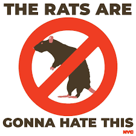

 


## Motivation

The primary goal of this project is to conduct a thorough analysis of rat sightings in New York City, focusing on the periods before and after the implementation of new trash pickup times, which shifted from after 4 pm to after 8 pm as of April 1, 2023. This change is part of Mayor Eric Adams' rat mitigation strategies, and our study aims to assess its effectiveness. The motivation behind this research is rooted in the significant public health concerns associated with increased rat sightings, especially post-COVID-19. Rats are known vectors for various diseases and can contaminate human food sources, posing a considerable health risk.

This project is also motivated by the need to evaluate public policy effectiveness, particularly in urban wildlife management. By comparing rat sighting data from different time periods and across various NYC neighborhoods, we aim to determine whether the change in trash disposal times has had a significant impact on the rat population. This analysis will not only contribute to public health knowledge but also offer insights for future urban management and rat mitigation strategies.

Last but certainly not least, the viral nature of New York City Sanitation Commissioner Jessica Tisch's declaration, "The rats don't run this city, we do," during the announcement of new rules for garbage disposal back in October 2022, significantly contributes to the motivation behind our project. This statement, which quickly became a social media sensation and inspired a wide array of TikTok videos and even merchandise, has heightened our interest in the issue of rat control in New York City.


```{r, echo=FALSE, out.width="40%", fig.cap="", fig.align = 'center'}
 
```

## Related work:
Anything that inspired you, such as a paper, a web site, or something we discussed in class.

## Initial questions: 
What questions are you trying to answer? How did these questions evolve over the course of the project? What new questions did you consider in the course of your analysis?

## Data:
Source, scraping method, cleaning, etc.

## Exploratory analysis:
Visualizations, summaries, and exploratory statistical analyses. Justify the steps you took, and show any major changes to your ideas.

## Additional analysis: 
If you undertake formal statistical analyses, describe these in detail

## Discussion: 
What were your findings? Are they what you expect? What insights into the data can you make?

As this will be your only chance to describe your project in detail, make sure that your report is a standalone document that fully describes your process and results. We also expect you to write high-quality code that is understandable to an outside reader. Coding collaboratively and actively reviewing code within the team will help with this!

